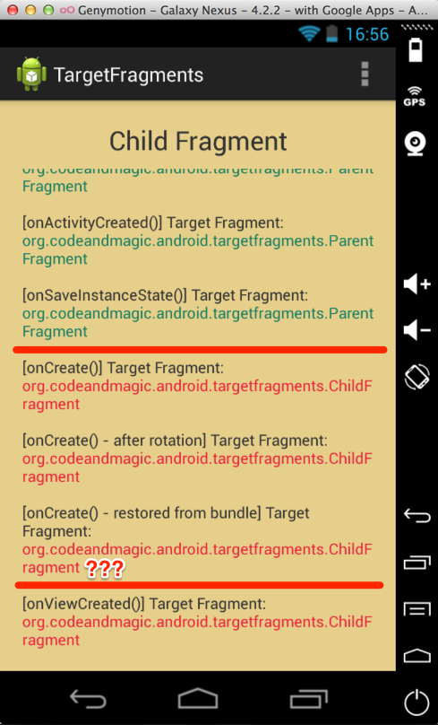

## AndroidTargetFragments

Android setTargetFragment() weirdness that I cannot comprehend...

### Steps to reproduce:

+ Create a fragment (ParentFragment)
+ Create another fragment inside the first one (ChildFragment) and call setTargetFragment() on the child to point to the ParentFragment
+ Add the ChildFragment using `getChildFragmentManager()`
+ (Optional) Use putFragment/getFragment methods to save the target fragment inside the ChildFragment
+ Rotate device
+ Call getTargetFragment() on the child

Surprise, surprise...it will not be the ParentFragment. Try the .apk below to see the results.

The workaround I'm using at the moment is to pass the ParentFragment tag (as String) to ChildFragment then when I need the parent, to look it up using getActivity().getFragmentManager().findFragmentByTag().

Interestingly enough, ***if `getFragmentManager()` is used instead to add the ChildFragment, the behaviour is the correct one***.

Then what's the purpose of `getChildFragmentManager()` ?

From documentation:

> public final FragmentManager getChildFragmentManager () [Added in API level 17]

> Return a private FragmentManager for placing and managing Fragments inside of this Fragment.

